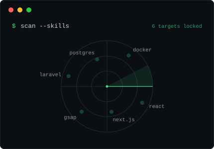

<!-- Bu profil tamamen kendi SVG'leriyle çalışır: animasyonlar SMIL ile SVG'lerin
     içine gömülüdür, üçüncü parti servis kullanılmaz.
     contrib-heatmap.svg ve stack.svg her gün GitHub Actions ile yeniden üretilir. -->

 

<a href="https://befior.com">befior.com</a> · built with hand-rolled animated SVGs, refreshed daily by <a href=".github/workflows/update-heatmap.yml">a cron job</a>

